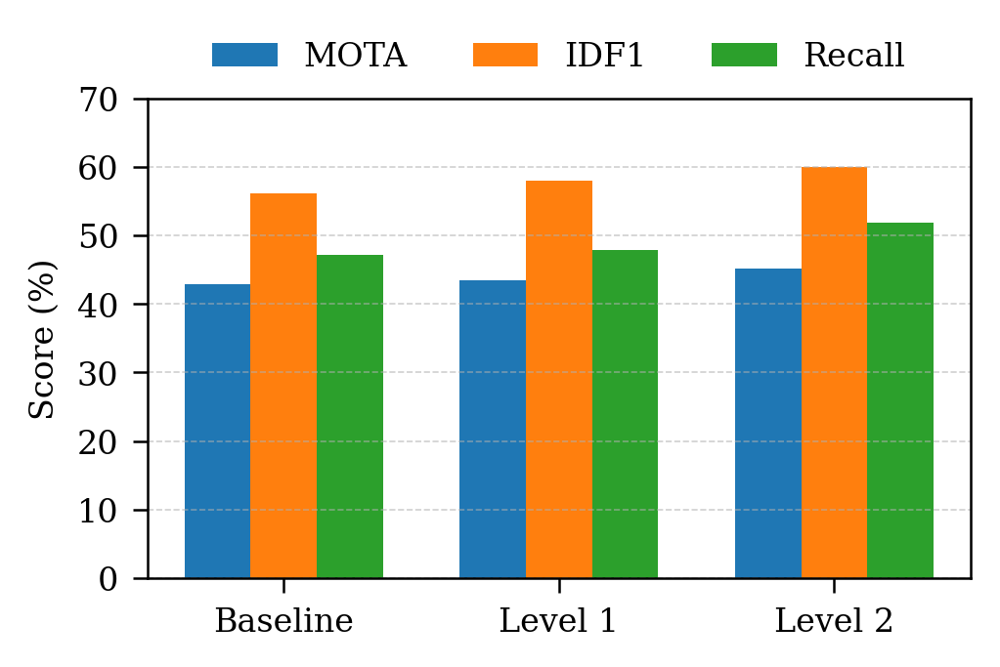
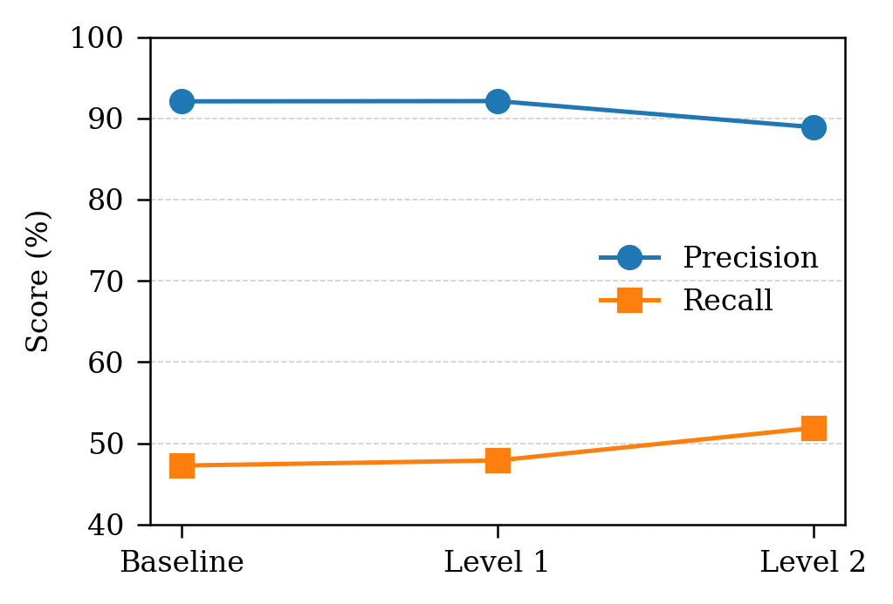
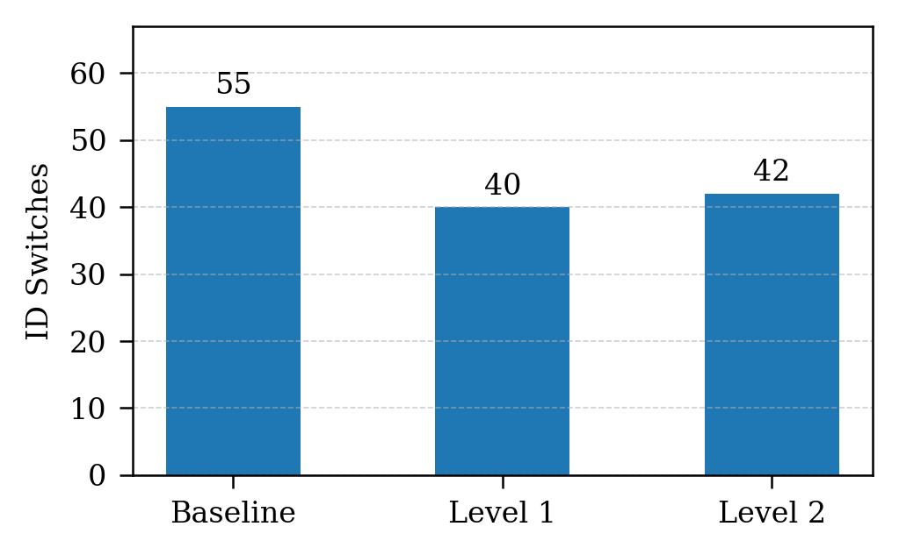

# Multi-Object Tracking Project

Vehicle tracking in video using YOLO11n and ByteTrack.

`main.py` is the main entry point. Choose one of three pipelines:

```text
baseline  YOLO + ByteTrack with the baseline configuration
level1    YOLO + ByteTrack with tuned parameters
level2    YOLO detector + the custom tracker implemented in trackers/
```

## Installation

```bash
pip install -r requirements.txt
```

If you use the project virtual environment:

```bash
.venv/bin/python main.py --help
```

## Run A Video With Ground Truth

Use this mode when the input video has a MOT-format ground truth file. The outputs are:

```text
tracking video .mp4
prediction .txt
metrics .csv from scripts/evaluate_mot.py
```

Example using Level 2:

```bash
python main.py \
  --level level2 \
  --with_gt \
  --video dataset/raw/Vehicle_Tracking/VNTraffic/VNTraffic_Original-video.mp4 \
  --gt dataset/raw/Vehicle_Tracking/VNTraffic/VNTraffic_GroundTruth.txt \
  --overwrite
```

`--with_gt` is the default, so this command is equivalent:

```bash
python main.py --level level2 --overwrite
```

## Run A Video Without Ground Truth

Use this mode when you only have an input video and want a tracking video with bounding boxes. The only project output is the tracking video.

```bash
python main.py \
  --level level2 \
  --no_gt \
  --video path/to/input_video.mp4 \
  --output_video outputs/video_result.mp4 \
  --overwrite
```

Change the pipeline with `--level`:

```bash
python main.py --level baseline --no_gt --video path/to/video.mp4 --output_video outputs/demo/baseline.mp4 --overwrite
python main.py --level level1   --no_gt --video path/to/video.mp4 --output_video outputs/demo/level1.mp4 --overwrite
python main.py --level level2   --no_gt --video path/to/video.mp4 --output_video outputs/demo/level2.mp4 --overwrite
```

## Default Outputs

If you do not pass custom output paths, `main.py` writes to:

```text
outputs/baseline/
outputs/level1/
outputs/level2/
```

For videos with ground truth:

```text
outputs/<level>/vntraffic_<level>_yolo11n_<tracker>.txt
outputs/<level>/tables/vntraffic_<level>_metrics.csv
outputs/<level>/vntraffic_<level>_yolo11n_<tracker>.mp4
```

For videos without ground truth:

```text
outputs/<level>/vntraffic_<level>_yolo11n_<tracker>.mp4
```

You can choose custom output paths:

```bash
python main.py \
  --level level1 \
  --with_gt \
  --video path/to/video.mp4 \
  --gt path/to/gt.txt \
  --output_video outputs/custom/tracking.mp4 \
  --pred outputs/custom/prediction.txt \
  --metrics outputs/custom/metrics.csv \
  --overwrite
```

## Result Figures

The figures below summarize the current VNTraffic tracking results generated from the project outputs.

MOTA, IDF1, and Recall comparison:



Precision and Recall comparison:



ID switches comparison:



## Common Options

Show class names and confidence scores on bounding boxes:

```bash
python main.py --level level2 --no_gt --video path/to/video.mp4 --show_class --show_conf --overwrite
```

Run a quick test on the first frames:

```bash
python main.py --level level2 --no_gt --video path/to/video.mp4 --max_frames 100 --overwrite
```

Use a custom one-class `vehicle` model with class ID `0`:

```bash
python main.py --level level2 --model runs/detect/train/weights/best.pt --classes 0 --overwrite
```

Disable class filtering:

```bash
python main.py --level level2 --all_classes --overwrite
```

## Code Structure

```text
main.py
  Main entry point. Select baseline, level1, or level2, and choose whether ground truth is available.

scripts/export_baseline_result.py
  Exports YOLO + ByteTrack tracking results as a MOT-format txt file.

scripts/render_tracking_video.py
  Renders a tracking video with bounding boxes, track IDs, and optional class/confidence labels.

scripts/evaluate_mot.py
  Computes MOT metrics from a ground truth file and a prediction txt file.

scripts/tuned_level_1.py
  Level 1 pipeline: YOLO + ByteTrack with tuned config.

scripts/tuned_level_2.py
  Level 2 pipeline: YOLO detector + custom tracker.

trackers/
  Custom tracker components used by Level 2.

configs/
  Tracker configuration files.
```

## Notes

The default model is `yolo11n.pt`. Because it is COCO-pretrained, the code keeps only vehicle classes by default:

```text
car, motorcycle, bus, truck
```

For videos without ground truth, use `--no_gt` to avoid evaluating against the default VNTraffic ground truth file.
